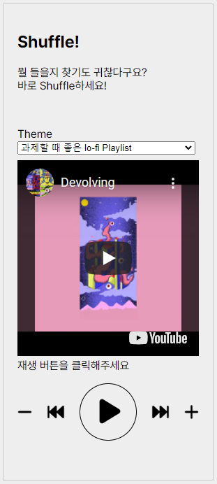
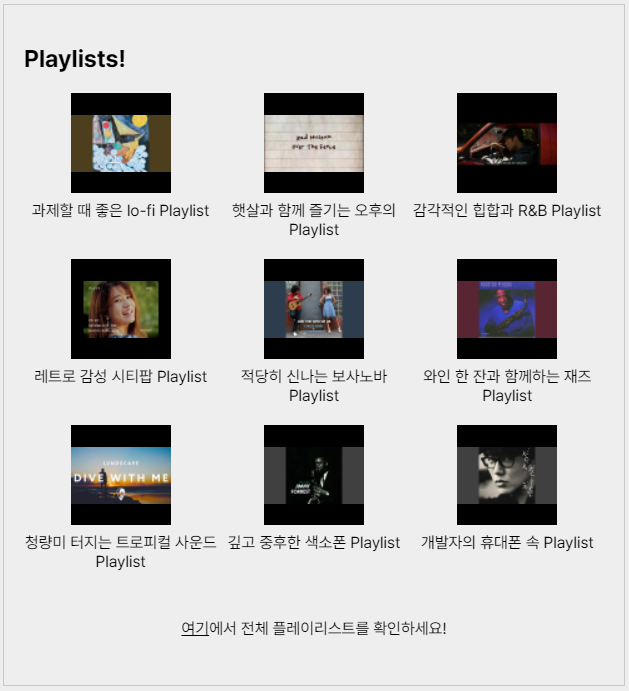
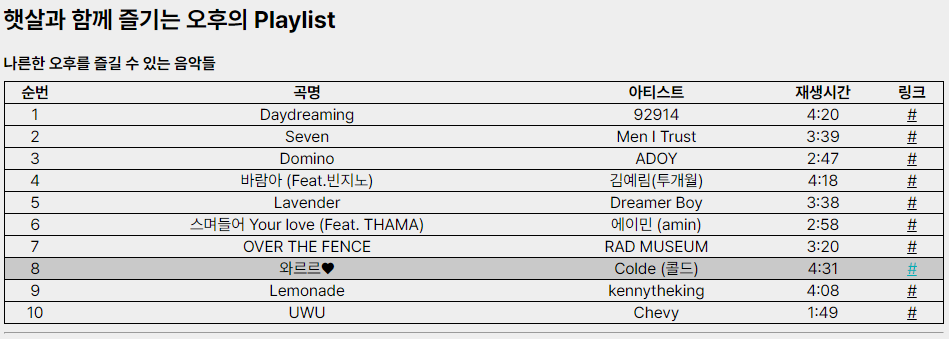
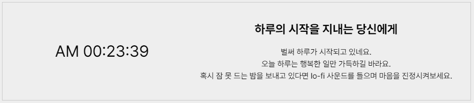
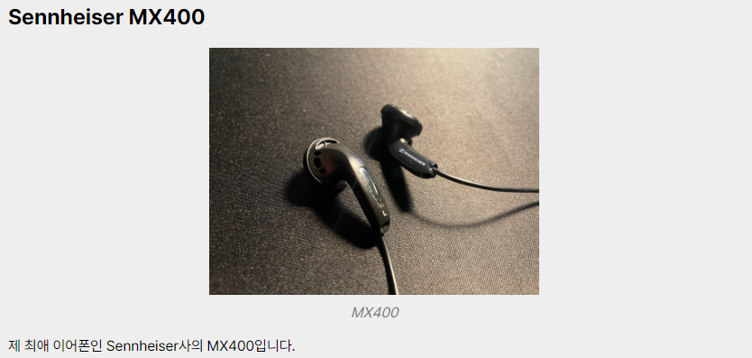
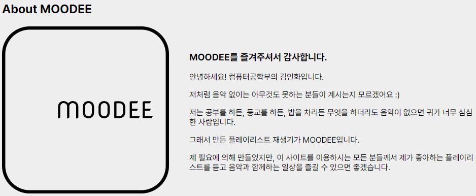
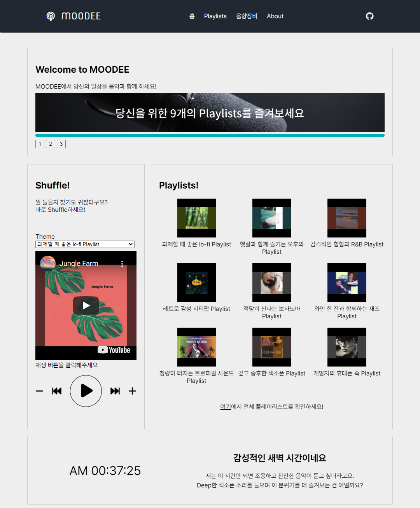
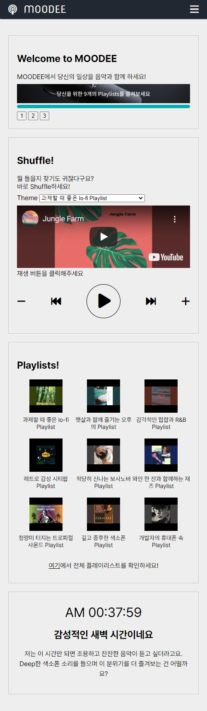

# MOODEE

MOODEE는 언제든지 일상의 배경음악이 되어줄 Playlist 모음집입니다.

[Link#1](https://moodee.radia.me)
[Link#2(Mirror)](http://csweb.kyonggi.ac.kr/users/201810548/index.html)

- [MOODEE](#moodee)
  - [주요기능](#주요기능)
    - [Shuffle!](#shuffle)
    - [Playlists!](#playlists)
    - [Conversation](#conversation)
    - [음향장비 마이크로 블로그](#음향장비-마이크로-블로그)
    - [About MOODEE](#about-moodee)
    - [반응형 웹](#반응형-웹)

## 주요기능

- Shuffle!
- Playlists!
- Conversation
- 음향장비 마이크로 블로그
- About MOODEE
- 반응형 웹

Shuffle!, Playlists!, Conversation은 홈 화면에서 즉시 접근 가능한 기능들입니다.

음향장비 마이크로 블로그와 About MOODEE는 내비게이션 바의 링크를 통해 접근할 수 있습니다.

---

### Shuffle!

> Shuffle! 은 Playlist의 음악을 무작위로 Shuffle 하여 재생시키는 플레이어입니다.

Theme에서 원하는 Playlist를 고르고 재생 버튼을 누르면 즉시 재생됩니다.

Playlist의 끝까지 재생이 완료되면 Loop 하여 첫 곡부터 다시 재생됩니다.

---

### Playlists!

> Playlists!는 MOODEE에서 제공하는 Playlist들의 상세 정보를 확인할 수 있는 링크를 제공합니다.

페이지가 로드될 때마다 각 Playlist 내의 음악 중 하나를 무작위로 선별하여 Playlist의 커버 이미지로 사용합니다.

이미지 또는 Playlist를 클릭 시, 선택한 Playlist의 세부사항이 정리된 표가 있는 페이지로 이동합니다.

전체 Playlist의 세부사항을 확인하고 싶다면 내비게이션 바의 'Playlists' 링크를 통해 이동하는 방법도 제공합니다.

---

### Conversation

> Conversation은 개발자가 사용자에게 전하고 싶은 메시지를 출력합니다.

시간대에 따라 여러 메시지가 준비되어 있으며 페이지가 로드될 때마다 새로운 메시지를 출력합니다.

간단한 시계와 메시지를 함께 제공하여 시간의 흐름을 인지하고 메시지의 문맥을 자연스럽게 이해할 수 있는 사용 흐름을 만들어냅니다.

---

### 음향장비 마이크로 블로그

> 음향장비 마이크로 블로그는 개발자가 사용하고 있는 음향장비를 소개하는 페이지입니다.

내비게이션 바의 '음향장비' 링크를 통해 접근할 수 있습니다.

개발자가 본인의 음향 취향에 대한 설명과 사용하는 제품들의 간단한 리뷰를 볼 수 있습니다.

---

### About MOODEE

> About은 개발자 본인의 간단한 소개를 작성해놓은 페이지입니다.

내비게이션 바의 'About'을 통해 접근할 수 있습니다.

MOODEE의 초기 로고와 함께 소개 글을 볼 수 있습니다.

---

### 반응형 웹

반응형 웹을 지원합니다.

디바이스의 디스플레이 크기에 알맞는 최적화된 화면을 보여줍니다.

데스크톱 환경의 MOODEE

모바일 환경의 MOODEE
